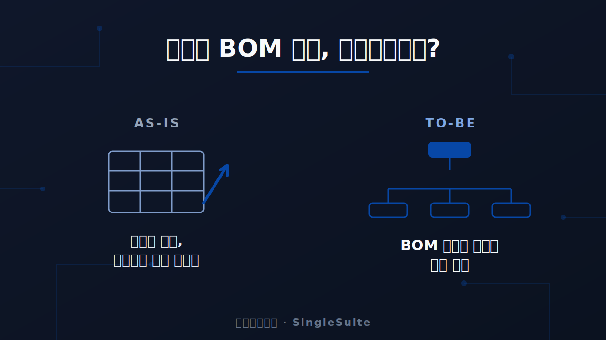

<!--
제목: LME 시세가 흔들릴 때, 당신의 다단계 BOM 원가는 안전하십니까?
핵심 키워드: 다단계 BOM 원가관리
보조 키워드: LME 시세 원가, 목표원가 관리, 전자구매 SRM, 원가 시뮬레이션, SingleSuite
작성일: 2026-07-02
-->

# LME 시세가 흔들릴 때, 당신의 다단계 BOM 원가는 안전하십니까?

원자재 시세 리스크의 본질은 가격이 오른다는 사실 자체가 아니라, 그 변동이
어디까지 영향을 미치는지를 제때 파악할 수 없다는 데 있습니다. LME에서 변동한
금속 시세 하나가 우리 완제품 원가를 얼마나 상승시키는지, 지금 바로 답할 수 있는
담당자는 많지 않습니다. **다단계 BOM 원가관리**가 명확한 기준 없이 운영되는 한,
시세 변동은 언제나 마감이 끝난 뒤에야 원가로 확인됩니다.

## 시세 변동은 왜 BOM을 따라 증폭되는가

원자재 한 품목의 시세 변동은 그 품목 하나의 문제로 끝나지 않습니다. 해당 원소재는
반제품의 구성 요소가 되고, 그 반제품은 다시 상위 모듈과 완제품의 구성 요소가
됩니다. 시세 변동은 이 계층 구조를 따라 상위 품목 원가에 누적적으로 반영됩니다.
계층이 깊을수록 최종 원가에 미치는 영향은 커지지만, 그 크기는 계층 전체를
계산해야만 드러납니다.

• **누적 반영**: 하위 원소재의 단가 변동이 상위 품목 원가에 단계적으로 더해집니다. 계층이 깊을수록 최종 원가의 변동 폭이 확대됩니다.
• **경로 불투명**: 어떤 원소재가 어떤 완제품 원가에 얼마나 기여하는지는 계층을 역으로 추적해야 확인됩니다. 구조가 복잡할수록 확인 비용이 증가합니다.
• **시차 발생**: 시세는 상시 변동하지만 원가 반영은 이를 따라가지 못합니다. 변동 시점과 인지 시점 사이에 간극이 생깁니다.

## 수작업과 분산된 관리로는 왜 한계가 있는가

이 구조적 문제를 다수의 기업은 담당자의 수작업과 개별 스프레드시트로 다룹니다.
그러나 수백 계층의 BOM을 사람이 계산으로 추적하는 방식은 시세가 움직일 때마다
반복되기 어렵습니다. 단가 정보가 담당자별 문서에 분산되어 있으면, 동일 품목에
서로 다른 단가가 병존하고 최신 시세의 반영도 지연됩니다.

• **추적의 비반복성**: 계층 전체 계산을 시세 변동마다 수작업으로 되풀이하기 어렵습니다. 결국 일부 품목만 갱신되고 나머지는 과거 단가로 남습니다.
• **기준의 분산**: 단가가 문서별로 흩어져 있어 어느 값이 최신인지 판단하기 어렵습니다. 부서 간 원가 기준이 어긋납니다.
• **사후 확인**: 이탈은 대부분 결산 이후에 드러납니다. 대응 시점이 지난 뒤에 문제가 확인됩니다.

## 전파 경로를 계산 가능한 대상으로 전환합니다

세포아소프트 **SingleSuite**는 이 문제를 개별 단가가 아니라 구조의 문제로
접근합니다. 전자구매/SRM은 원자재 시세를 단가 산정의 안쪽으로 편입하고, 다단계
BOM 원가 전개는 하위 변동을 상위 품목 원가로 자동 반영합니다. 예를 들어 전기동
시세가 5% 상승한다고 가정하면, 그 변동이 어떤 완제품 원가를 얼마나 상승시키는지
발주 이전에 산출됩니다.

• **시세 연동**: 전자구매/SRM에서 원자재 시세를 발주단가 산정에 직접 반영합니다. 시세가 참고 정보가 아니라 원가 계산의 입력값으로 작동합니다.
• **원가 전개**: 다단계 BOM 원가 전개로 하위 변동을 상위 품목 원가까지 자동 반영합니다. 계층을 수작업으로 추적하지 않아도 영향이 계산됩니다.
• **사전 시뮬레이션**: 원가 시뮬레이션으로 시세 시나리오별 원가 영향을 발주 전에 비교합니다. 대응 여부를 원가 확정 이전에 판단할 수 있습니다.

## 목표원가 이탈을 사전에 인지합니다

전파 경로를 계산할 수 있게 되면, 다음 과제는 그 계산을 상시 감시로 연결하는
것입니다. **목표원가 관리**의 초점을 사후 확인에서 상시 감시로 전환하면, 목표
기준을 초과하는 시점을 마감 이전에 인지할 수 있습니다. 이탈이 발생하는 시점에
신호가 전달되면, 그 단계에서는 아직 대응할 시간이 남아 있습니다.

• **조기 인지**: 목표 기준을 초과하는 시점을 마감 이전에 인지합니다. 원가 이탈을 결산 결과가 아니라 진행 중 신호로 확인합니다.
• **대상 선별**: 임계치를 벗어난 품목을 우선순위로 분리합니다. 전체를 검토하는 대신 문제 품목에 대응을 집중할 수 있습니다.
• **시간 확보**: 재협상·설계 변경·대체 소싱을 검토할 시간을 확보합니다. 대응 수단을 선택할 여유가 남은 시점에 의사결정이 가능합니다.

## 맺음말 — 다음 원가 회의 전에 스스로 답해 볼 질문

정교한 원가 통제는 결국 하나의 질문으로 압축됩니다. 시세라는 통제 불가능한
변수를, BOM이라는 내부 구조 위에서 얼마나 투명하게 파악하고 있는가 하는
질문입니다. 시세 리스크는 개별 단가를 촘촘히 관리하는 것만으로는 통제되지
않으며, BOM 전체를 관통하는 하나의 시스템 위에서만 관리됩니다.

지금 이 질문에 별도 자료 없이 답할 수 있는지 스스로 점검해 보시기를 권합니다.
예를 들어 원자재 한 품목이 10% 상승한다면, 주력 제품의 원가는 얼마나 상승하는가
하는 질문입니다. 몇 초 안에 답할 수 있다면 이미 잘 관리되고 있는 것이며, 자료부터
확인해야 한다면 **다단계 BOM 원가관리**를 개별 단가 중심에서 시스템 중심으로
전환할 시점입니다.
